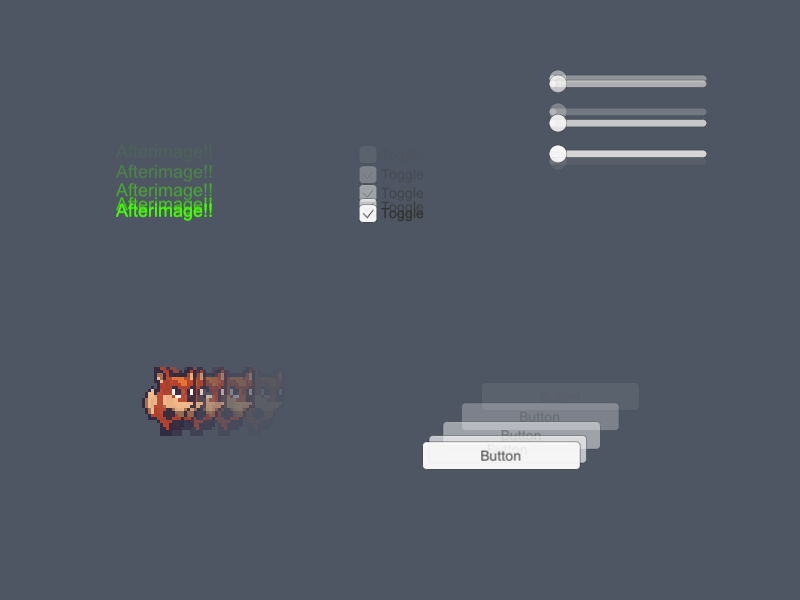

# Afterimage
> Afterimage VFX for Unity

| Cube                               | UI                                 | Butterfly                          |
|:-----------------------------------|:-----------------------------------|:-----------------------------------|
|  |  |  |

## 🏆 Features

* One step to add a component to the scene
* Fully compatible with Unity system
* Provide auto and manual update of trail
* Support fade out for 2D/3D gameobject
* Fully accessible to source code
* Compatible with all devices, including mobile
* Work with UI/Canvas
* Lightweight and easy to use
* Highly customizable with script

## License

Copyright (c) Pixisoft. All rights reserved.

pixisoft.tw@gmail.com
