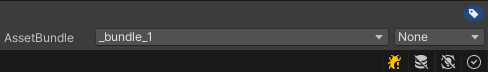
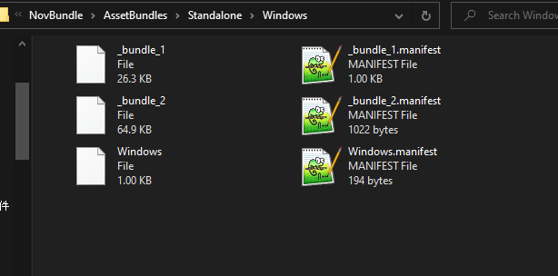
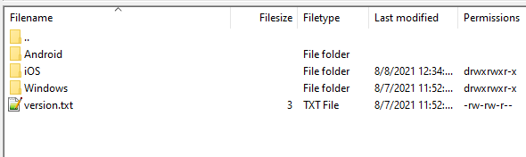
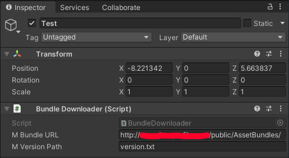
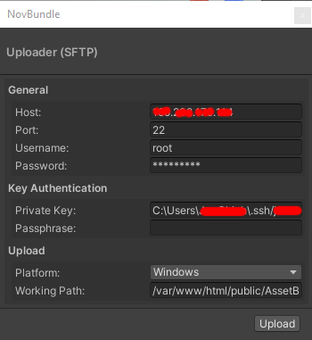

# NovBundle

**NovBundle** is a abstraction layer built on top of Asset Bundles system from
Unity Engine. This plugin focuses on simplifying the Asset Bundles workflow so
the user would not have to know too much details about the system itself.

## 🔨 How to use?

There are major three parts for you to master this package. Three parts including
`Creation`, `Upload`, `Call API`. The following instructions would help you get
through the basic usage of each parts.

### 🔍 How to create Asset Bundles?

#### 1. Create Asset Bundle

Asset Bundles are generated by platforms, hence you would have multiple folders
organized by platforms. First select a asset from the `Project` window then
create a new Asset Bundle under the `Inspector` window.



*P.S. Here we created a asset bundle named `_bundle_1`*

#### 2. Build Asset Bundle for target platform

Then navigate to your menu bar **NovBundle** -> **Build** -> **Target Platform**,
you should be prompt to select your output path. The following is what the
outputted result should look like.



*P.S. You can export multiple platform but make sure you have organized in platform folder*

### 🔍 Upload to server

#### 1. Upload Asset Bundles files

In order to use these files, we need to upload our exported files to a server.
You can use FTP client like [FileZilla](https://filezilla-project.org/) or
other alternatives to do so.

#### 2. Upload `version.txt` file

You would need to create a text file for Asset Bundles caching system. Here I
have created a text file name `version.text` with the content of `1`.

The text file content,

```
1
```

*P.S. Make sure the number should only be an unsign integer, hence should not
be number lower than 0!*



### 🔍 Download and use the Asset from the bundle

#### 1. Attach component `BundleDownloader`

Drag and drop the script `BundleDownloader` to any GameObject in the scene, so
it would start function. Make sure you fill in the variable `Bundle URL` with
your Asset Bundles url.



*For more information, see section [Testing](#pencil-testing).*

#### 2. Access asset from script

Once you have done the above instructions, you are ready to use the asset
from your Assets Bundle. The following code is a simple example for you to use
the asset from the asset bundle you have created.

```cs
using NovBundle;

...

BundleDownloader.instance.BundleAsset(
    "_bundle_1",  // Name of the bundle
    "assets/_project/prefabs/sphere.prefab", (asset) =>  // Target asset, and callback
{
    // Instantiate the prefab to scene
    Instantiate(asset, new Vector3(10, 0, 10), Quaternion.identity);
});
```

*🎉 Done!*

## 💾 Uploader (SFTP)

After version `0.2.1`, you can now upload the asset bundles over the graphical
user interface by using **NovBundle** -> **Upload** window.



## 🖥️ Batch Mode

You can build Asset Bundles by using Unity's batch mode.

| Method                            | Arguments                                                                                                                                                 | Details                                              |
|:----------------------------------|:----------------------------------------------------------------------------------------------------------------------------------------------------------|:-----------------------------------------------------|
| `NovBundle.BatchMode.BuildBundle` | `--platform`, `--savePath`                                                                                                                                | Build target asset bundles to save path.             |
| `NovBundle.BatchMode.Upload`      | `--platform`, `--savePath`, `--host`, `--port`, `--username`, `--password`, `--privateKey`, `--passphrase`, `--workingPath`, `--versionFile`, `--version` | Upload the asset bundles to the server through SFTP. |

| Command         | Details                                                     |
|:----------------|:------------------------------------------------------------|
| `--platform`    | Platform asset bundles to build.                            |
| `--savePath`    | Where to save the asset bundles.                            |
| `--host`        | Host name for SFTP.                                         |
| `--port `       | Optional port number. (Default to 22)                       |
| `--username`    | Username for login.                                         |
| `--password`    | Password for login.                                         |
| `--privateKey`  | Path points to your private key.                            |
| `--passphrase`  | Passphrase for your private key.                            |
| `--workingPath` | Target path from your server.                               |
| `--versionFile` | Version text file. (Default to `version.txt`)               |
| `--version`     | Version number apply to version text file. (Default to `1`) |

For example,

```
$UNITY_PATH -batchmode -quit -projectPath "." -executeMethod NovBundle.BatchMode.BuildBundle --platform "Windows" --savePath "."
```

The `$UNITY_PATH` is the path to Unity executable hence it depends on variant OS.

On macOS,

```
/Applications/Unity/Unity.app/Contents/MacOS/Unity
```

On Windows,

```
"C:\Program Files\Unity\Editor\Unity.exe"
```

For more information, see [Command line arguments](https://docs.unity3d.com/Manual/CommandLineArguments.html).


## 📝 Testing

#### Methods 1. Test it on your server

For exampl,e `http://www.yourwebsite.com/example/scenes.assetbundle`

#### Methods 2. Test it with file url

For exampl,e `file://C:/example/scenes.assetbundle`

## 🔗 References

* [ARFoundation Unity Tutorial: Asset Bundles (Download 3D Models At Runtime)](https://www.youtube.com/watch?v=twzfpuaM-Js&ab_channel=ThirdAurora)
* [在 Unity 使用 AssetBundles 實作簡易的遊戲資源打包以及更新機制](https://dev.twsiyuan.com/2017/04/unity-assetbundles.html)
* [Packaging content with Addressable Assets | Open Projects Devlog](https://www.youtube.com/watch?v=XIHINtB2e1U&t=104s&ab_channel=Unity)
* [All about AssetReferences](https://www.youtube.com/watch?v=aSumpv7Y7FE&ab_channel=Badgerdox)

## License

Copyright (c) Pixisoft. All rights reserved.

See LICENSE.txt for details.
