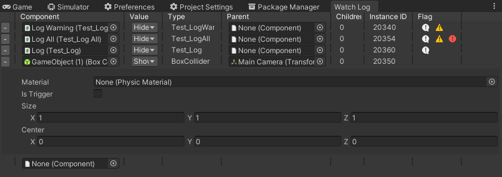

# WatchLog

A dedicated tool that tracks variable over time.

  

## 📁 Project Structures

> 
> 

* `Source` - Project contains plugin's source code.
* `Compile` - Project compiles source to DLL, it will link `_references` DLLs.
* `_references` - Unity DLL to compile project source to DLL.

> 
> 

* `Publish` - Project that contains package DLL and ready to publish to [Asset Store Publisher](https://publisher.assetstore.unity3d.com/info.html?_gl=1*1fwg1ij*_ga*MTg0NjU4MTc4NC4xNjAwMzQ5NzM3*_ga_1S78EFL1W5*MTYyNDI3MzU4Ni40Ni4wLjE2MjQyNzM1ODYuNjA.&_ga=2.77544981.1416380940.1624186429-1846581784.1600349737) portal.

## 🏆 Features

* Out of box
* Lightweight and easy to use
* Display an editor window with the data you want to keep an eye on
* Show Error/Warning/Log information
* Display each value in categories

## License

Copyright (c) Pixisoft. All rights reserved.

pixisoft.tw@gmail.com
